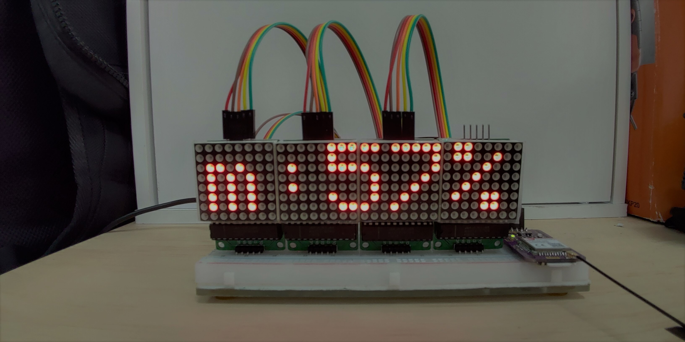

# ESP32_openweather
ESP32_openweather 用ESP32自製NBIoT氣象預報站教學！ 

* 整體架構

* 電路

* 詳細介紹文章：
[等等會下雨嗎？用ESP32自製NBIoT氣象預報站教學！](https://www.atticedu.com/index.php/blog/am7020_blog/51-%E7%94%A8esp32%E8%87%AA%E8%A3%BDnbiot%E6%B0%A3%E8%B1%A1%E9%A0%90%E5%A0%B1%E7%AB%99%E6%95%99%E5%AD%B8%EF%BC%81.html)
